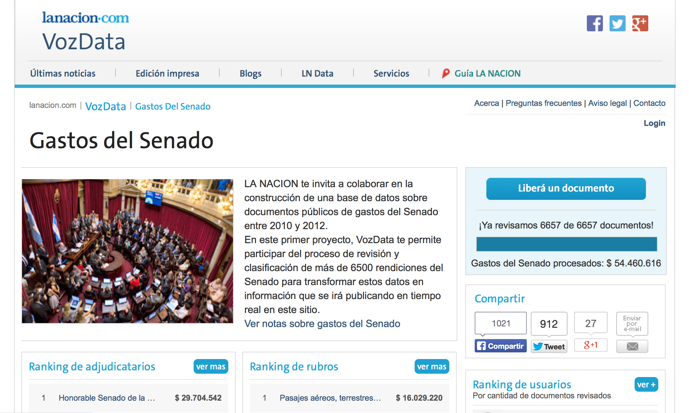

.. CrowData documentation master file, created by
   sphinx-quickstart on Tue May 20 13:43:31 2014.
   You can adapt this file completely to your liking, but it should at least
   contain the root `toctree` directive.

Crowdsourcing the liberation of data trapped in documents!
==========================================================

``CrowData`` is a tool to collaborate on the verification or release of data that otherwise would be hard or impossible to get via automatic tools.

But the outcome of Crowdata is more than only to extract data. With Crowdata you can work with your community on a data set. They can navigate the data, help to extract it via a game and make comments on information that may be interesting to look at by journalists.

When to use Crowdata?
=====================

* `VozData <http://vozdata.lanacion.com.ar>`_ is a website from `La Nacion <http://www.lanacion.com.ar>`_ in Argentina to convert scanned PDF documents from senate spendings into an usable dataset. `Collaborating to free data from PDFs <http://blogs.lanacion.com.ar/projects/data/vozdata/>`_.

Contents
--------

.. toctree::
   :maxdepth: 2

   technical
   install
   schema
   how to use it

Similar projects
================

Crowdata was inspired by the project from ‘ProPublica <http://www.propublica.org>’_ called ‘Free the Files <https://projects.propublica.org/free-the-files/>’_ and The Guardian MP´s Expenses and Sarah Palin´s Emails.
 It was born from a need that La Nacion had to transform scanned image PDFs into a comprehensible and structured dataset, and ask for their community's help to catalog those spendings that call their attention.

Here are some of the projects that do the same for some specific cases.

* `Free the Files <http://www.propublica.org/series/free-the-files>`_
* `Yanukovych Leaks <http://www.yanukovychleaks.org/detail/23570/>`_
* `How to crowdsource MPs' expenses <http://www.theguardian.com/news/datablog/2009/jun/18/mps-expenses-houseofcommons>`_

Credits
=======

'Crowdata' is an open source project that was born when Manuel Aristaran was an Open News fellow at La Nacion in 2013. It was finally released as free software when Gabriela Rodriguez  continued it for VozData in 2014. Thanks to Cristian Bertelegni and La Nacion for contributing to the code.

Now it relies on contributions from people and organizations. Please, use it, comment on it and make improvements by pull requests in `GitHub <http://github.com/crowdata/crowdata>`_.

Contributions
=============

* Fork the repo
* Clone your fork
* Make a branch of your changes
* Make a pull request through GitHub, and clearly describe your changes

Indices and tables
==================

* :ref:`genindex`
* :ref:`modindex`
* :ref:`search`
